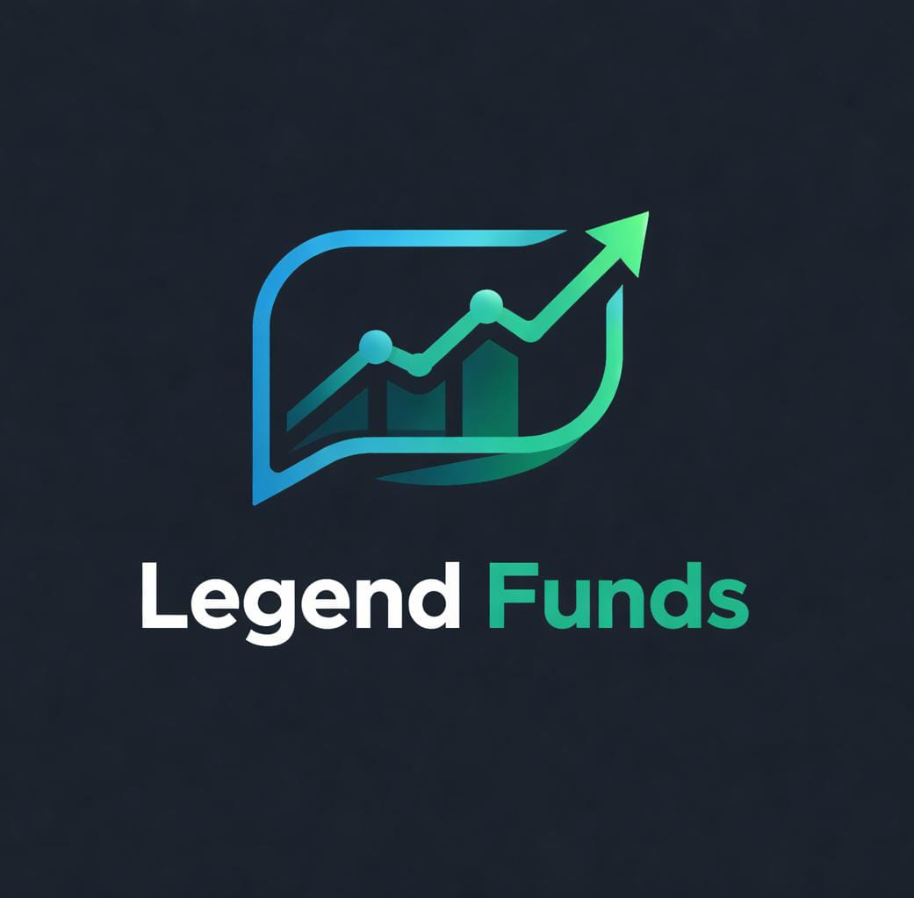

# 🚀 Legends Funds - AI-Powered Trading App

<div align="center">



**Real-time stock trading with AI investment assistant powered by Google Gemini**

[](https://flutter.dev)
[](https://python.org)
[](https://ai.google.dev)

[Features](#-features) • [Demo](#-demo) • [Installation](#-installation) • [Architecture](#-architecture) • [Contributing](#-contributing)

</div>

---

## 📱 Features

### 🔴 Real-Time Stock Data
- Live prices for 5 major Indian bank stocks (HDFC, SBI, ICICI, KOTAK, AXIS)
- WebSocket connection to Angel One Smart API
- Updates every 2 seconds
- Binary data parsing with 100% accuracy

### 📊 Interactive Charts
- Beautiful line charts showing price movements
- Last 50 data points visualization
- Color-coded gains (green) and losses (red)
- Smooth animations

### 💼 Portfolio Management
- Add stocks to your portfolio
- Track holdings in real-time
- Live profit/loss calculations
- Total portfolio value tracking

### 🤖 AI Investment Assistant
- Powered by Google Gemini 2.5 Flash
- Context-aware responses
- Knows your portfolio holdings
- Personalized investment advice
- Quick action buttons for common queries

### 🎨 Beautiful UI/UX
- Modern dark theme
- Time-based greetings
- Smooth animations
- Cross-platform support (Android, iOS, Web, Windows, macOS)

---

## 🎬 Demo

### Screenshots

| Home Screen | Portfolio | AI Chat |
|------------|-----------|---------|
|  |  |  |

### Video Demo
🎥 [Watch Demo Video](https://youtu.be/YOUR_VIDEO_LINK)

---

## 🛠️ Installation

### Prerequisites
- Flutter SDK (3.10.4 or higher)
- Python 3.x
- Angel One Smart API credentials
- Google Gemini API key

### Backend Setup

1. **Clone the repository**
```bash
git clone https://github.com/YOUR_USERNAME/legends_funds.git
cd legends_funds
```

2. **Install Python dependencies**
```bash
pip install -r requirements.txt
```

3. **Configure credentials**
```bash
# Copy example credentials
cp credentials.example.py credentials.py

# Edit credentials.py with your actual values:
# - Angel One API key
# - Angel One user ID
# - Angel One PIN
# - TOTP secret
```

4. **Generate JWT token**
```bash
python generate_token.py
```

5. **Start the backend server**
```bash
python stock_feed_server.py
```

Server will run on `http://localhost:5000`

### Frontend Setup

1. **Navigate to Flutter app**
```bash
cd legends_funds_app
```

2. **Install dependencies**
```bash
flutter pub get
```

3. **Run the app**
```bash
flutter run
```

Select your target device (Chrome, Windows, Android, iOS)

---

## 🏗️ Architecture

```
┌─────────────────────────────────────────────────────────┐
│                    ANGEL ONE SMART API                  │
│              wss://smartapisocket.angelone.in           │
└─────────────────────────────────────────────────────────┘
                          ↓ WebSocket
┌─────────────────────────────────────────────────────────┐
│              PYTHON BACKEND (Flask)                     │
│  - WebSocket client                                     │
│  - Binary data parser                                   │
│  - JWT token management                                 │
│  - REST API (localhost:5000)                            │
└─────────────────────────────────────────────────────────┘
                          ↓ HTTP/REST
┌─────────────────────────────────────────────────────────┐
│              FLUTTER FRONTEND                           │
│  - Provider state management                            │
│  - fl_chart for visualizations                          │
│  - HTTP polling (2 sec)                                 │
│  - Google Gemini integration                            │
└─────────────────────────────────────────────────────────┘
```

---

## 📂 Project Structure

```
legends_funds/
├── stock_feed_server.py       # Main backend server
├── generate_token.py           # JWT token generator
├── credentials.example.py      # Example credentials
├── requirements.txt            # Python dependencies
├── README.md                   # This file
│
└── legends_funds_app/          # Flutter application
    ├── lib/
    │   ├── main.dart           # App entry point
    │   ├── models/             # Data models
    │   ├── providers/          # State management
    │   ├── screens/            # UI screens
    │   ├── services/           # API services
    │   └── widgets/            # Reusable widgets
    ├── assets/                 # Images and icons
    └── pubspec.yaml            # Flutter dependencies
```

---

## 🔧 Technologies Used

### Backend
- **Python 3.x** - Core backend language
- **Flask** - REST API framework
- **WebSocket** - Real-time data streaming
- **pyotp** - TOTP authentication

### Frontend
- **Flutter** - Cross-platform UI framework
- **Provider** - State management
- **fl_chart** - Chart visualizations
- **http** - API communication
- **google_generative_ai** - Gemini AI integration

### APIs
- **Angel One Smart API** - Stock market data
- **Google Gemini 2.5 Flash** - AI chatbot

---

## 🔐 Security

- ✅ Credentials stored in separate file (not committed)
- ✅ JWT tokens auto-generated and refreshed
- ✅ `.gitignore` protects sensitive data
- ✅ Example credentials provided for setup
- ✅ 3-tier architecture for production deployment

---

## 🚀 Deployment

### Option 1: Local Development
Follow installation steps above

### Option 2: Production (Google Cloud VM)
1. Deploy Python backend on VM
2. Update Flutter app with VM IP
3. Configure firewall rules
4. Use screen/systemd for persistence

See [DEPLOYMENT.md](DEPLOYMENT.md) for detailed instructions

---

## 🤝 Contributing

Contributions are welcome! Please follow these steps:

1. Fork the repository
2. Create a feature branch (`git checkout -b feature/AmazingFeature`)
3. Commit your changes (`git commit -m 'Add AmazingFeature'`)
4. Push to the branch (`git push origin feature/AmazingFeature`)
5. Open a Pull Request

---

## 📝 License

This project is licensed under the MIT License - see [LICENSE](LICENSE) file for details

---

## 👥 Authors

- **Your Name** - [GitHub](https://github.com/YOUR_USERNAME)

---

## 🙏 Acknowledgments

- Angel One for Smart API
- Google for Gemini AI
- Flutter team for amazing framework
- Open source community

---

## 📞 Support

- 📧 Email: your.email@example.com
- 🐛 Issues: [GitHub Issues](https://github.com/YOUR_USERNAME/legends_funds/issues)
- 💬 Discussions: [GitHub Discussions](https://github.com/YOUR_USERNAME/legends_funds/discussions)

---

## 🎯 Roadmap

- [ ] Order placement functionality
- [ ] Support for 50+ stocks
- [ ] Price alerts and notifications
- [ ] Technical indicators (RSI, MACD)
- [ ] Historical data analysis
- [ ] Social features
- [ ] Global markets support

---

<div align="center">

**Built with ❤️ for Hack Days with Google Gemini**

⭐ Star this repo if you find it helpful!

</div>
